# Relatório Técnico

## 1. Diagrama

O pipeline integra técnicas clássicas e profundas para transformar imagens da câmera em informações úteis à navegação e à tomada de decisão de um veículo autônomo urbano.

```mermaid
flowchart LR
    A[Câmera / frame de entrada]
    B[Calibração de câmera<br/>Matriz K e distorção]
    C[Pré-processamento<br/>Undistort, redimensionamento e HSV]
    D[Detecção clássica<br/>ORB + HOG/SVM ou Haar Cascade]
    E[Detecção profunda<br/>YOLOv8n ou SSD MobileNetV2]
    F[Rastreamento<br/>IoU, IDs persistentes e trajetórias]
    G[Segmentação semântica<br/>DeepLabV3 ou FCN-ResNet50]
    H[Saída para navegação<br/>objetos, área navegável e risco]

    A --> B --> C --> D --> E --> F --> G --> H
```

A calibração corrige parâmetros internos e distorções da câmera. Em seguida, o pré-processamento melhora e organiza o frame para as etapas posteriores. Técnicas clássicas, como HSV, ORB e HOG/SVM ou Haar Cascade, fornecem análises rápidas de cor, regiões de interesse e características visuais. A detecção profunda identifica objetos relevantes, enquanto o rastreamento mantém suas identidades ao longo do vídeo. Por fim, a segmentação semântica classifica os pixels da cena, permitindo identificar área navegável, calçadas, vegetação, veículos e pedestres.

## 2. Tabela das técnicas estudadas

A tabela a seguir reúne as técnicas aplicadas nos trabalhos práticos. Os valores de velocidade e desempenho dependem do hardware, resolução da imagem, modelo utilizado e quantidade de frames processados. Por isso, os resultados devem ser interpretados no contexto dos testes realizados.

| Técnica | Aplicação no pipeline | Velocidade / latência medida | Acurácia ou indicador de qualidade | Complexidade | Observação |
|---|---|---:|---:|---|---|
| Calibração de câmera | Estimar matriz intrínseca e distorção | Não aferida em ms | Erro médio de reprojeção: **0,0246 px** | Baixa após a calibração | Erro inferior a 1 px é adequado para aplicações robóticas. |
| cv2.undistort | Corrigir distorção geométrica | Não aferida em ms | Avaliação visual da correção | Baixa | Etapa essencial antes de medições geométricas e detecção. |
| HSV | Segmentar regiões por cor, como pista e faixas | Não aferida em ms | IoU não registrado | Baixa | Muito rápido, mas sensível a sombras e mudanças de iluminação. |
| ORB | Extrair e comparar pontos de interesse | Não aferida em ms | Número de correspondências válidas não registrado | Baixa a média | Útil para referência visual e localização aproximada. |
| HOG + SVM / Haar Cascade | Detecção clássica de objetos | Não aferida em ms | Acurácia não registrada | Média | Menor custo que redes profundas, mas menor robustez visual. |
| MobileNetV2 com OpenCV DNN | Classificação de imagens | Não aferida em ms | Top-1 global não registrado | Média | Acertou a categoria geral de veículo, mas apresentou erro em uma imagem de caixa. |
| MobileNetV2 com Keras | Classificação de imagens | Não aferida em ms | Top-1 global não registrado | Média a alta | Mais adequado para treinamento e experimentação do modelo. |
| SSD MobileNetV2 | Detecção profunda de objetos | **13,25 FPS** / **75,48 ms** | mAP não registrado | Média | Arquivo de **66,46 MB**; detectou pessoas, carros, motocicletas e ônibus. |
| YOLOv8n | Detecção profunda de objetos | **22,05 FPS** / **45,35 ms** | mAP não registrado | Média | Arquivo de **6,25 MB**; obteve melhor desempenho que o SSD no mesmo vídeo. |
| Rastreamento por IoU | Manter IDs e trajetórias entre frames | Não aferida em ms | 14 entradas e 3 saídas; 1.788 novos IDs/min | Baixa | A taxa elevada de novos IDs indica instabilidade no rastreamento. |
| DeepLabV3 / FCN-ResNet50 | Segmentação semântica por pixel | Não aferida em ms | IoU/mIoU não registrado | Alta | Produz mapa de classes, overlay e proporção de área por categoria. |

Os resultados mostram que o YOLOv8n apresentou melhor relação entre velocidade e tamanho de arquivo quando comparado ao SSD MobileNetV2. O modelo alcançou 22,05 FPS e latência média de 45,35 ms, enquanto o SSD atingiu 13,25 FPS e 75,48 ms. Entretanto, métricas como mAP, IoU e acurácia top-1 não foram calculadas em todos os TPs; portanto, elas devem ser adicionadas em testes futuros para uma comparação quantitativa mais completa.

## 3. Viabilidade em hardware embarcado com restrição de 5 W

Em uma plataforma embarcada limitada a aproximadamente 5 W, técnicas clássicas devem ser priorizadas para execução contínua, pois demandam pouco processamento e apresentam baixa latência. A correção de distorção por `cv2.undistort`, a segmentação por HSV, a extração de características ORB e o rastreamento baseado em IoU são alternativas viáveis para operar em tempo real. Essas técnicas podem ser executadas diretamente na CPU e são adequadas para tarefas rápidas, como delimitar regiões de interesse, detectar faixas, manter a identidade de objetos e acompanhar trajetórias.

Métodos clássicos de detecção, como HOG+SVM ou Haar Cascade, também podem ser utilizados em hardware de baixo consumo, principalmente quando aplicados apenas em regiões de interesse previamente selecionadas por HSV. Entretanto, sua robustez é limitada em cenários urbanos com variação de iluminação, oclusões e objetos com grande diversidade visual.

Entre os modelos profundos avaliados, o YOLOv8n é o candidato mais viável para uso embarcado. Nos testes realizados, ele alcançou 22,05 FPS, latência média de 45,35 ms e tamanho de arquivo de 6,25 MB. Esses resultados foram superiores aos do SSD MobileNetV2, que apresentou 13,25 FPS, 75,48 ms de latência e arquivo de 66,46 MB. Mesmo assim, sob uma restrição de 5 W, o YOLOv8n deve usar resolução reduzida, quantização para INT8 e execução em acelerador de IA, quando disponível.

A segmentação semântica com DeepLabV3 ou FCN-ResNet50 possui maior custo computacional e não é recomendada para execução contínua em CPU dentro desse orçamento energético. Uma estratégia adequada é executá-la em frequência menor, por exemplo, a cada alguns frames, ou apenas em situações de maior risco. Dessa forma, o sistema pode combinar técnicas clássicas rápidas em todos os frames com detecção profunda e segmentação semântica em frequência adaptativa, equilibrando consumo, latência e segurança.

## 4. Proposta de arquitetura de percepção para veículo autônomo urbano

A arquitetura proposta utiliza uma câmera frontal como fonte principal de dados e integra seis técnicas estudadas na disciplina. Inicialmente, cada frame passa pela calibração e correção de distorção com `cv2.undistort`, garantindo que as etapas seguintes trabalhem com uma geometria de imagem mais confiável. Em seguida, a segmentação HSV identifica rapidamente regiões de interesse, como pista, faixas ou áreas com cores características, reduzindo a região a ser analisada pelos métodos mais custosos.

A extração de características ORB é utilizada para localizar pontos visuais estáveis entre frames consecutivos, contribuindo para a estimativa de deslocamento da câmera e para a identificação de referências no ambiente. Paralelamente, o YOLOv8n realiza a detecção profunda de objetos dinâmicos, como carros, motocicletas, ciclistas, pedestres e semáforos. As detecções são enviadas a um rastreador baseado em IoU, que atribui IDs persistentes aos objetos e mantém suas trajetórias, permitindo estimar movimento, entradas, saídas e risco de colisão.

Por fim, a segmentação semântica com DeepLabV3 ou FCN-ResNet50 classifica os pixels da cena em categorias como área navegável, calçada, vegetação, veículos e pessoas. Essa etapa complementa o detector profundo: enquanto o YOLO localiza objetos por caixas delimitadoras, a segmentação fornece a ocupação detalhada da cena. A saída integrada reúne geometria corrigida, regiões de pista, objetos detectados e rastreados, além da área navegável, fornecendo informações para planejamento de trajetória, frenagem e desvio de obstáculos.

Para respeitar uma plataforma embarcada o HSV, ORB e rastreamento devem operar continuamente, enquanto YOLOv8n e segmentação semântica podem executar com resolução reduzida ou em frequência adaptativa.

## 5. Lacunas que serão endereçadas na DR4 — Veículos Autônomos e Robótica Móvel

A primeira lacuna pode ser a fusão sensorial. O pipeline atual é baseado principalmente em imagens de câmera, o que o torna vulnerável a baixa iluminação, chuva, neblina, reflexos e oclusões. Na próxima disciplina, será importante integrar dados de câmera, LiDAR, radar, GPS e IMU para aumentar a confiabilidade da percepção e da localização do veículo.

A segunda lacuna é a percepção temporal e a previsão de movimento. Embora o rastreamento por IoU mantenha identificadores entre frames, ele não estima adequadamente velocidade, trajetória futura ou intenção de pedestres, ciclistas e veículos. Técnicas como filtros de Kalman, associação de trajetórias e previsão de comportamento serão necessárias para antecipar riscos e apoiar decisões de frenagem ou desvio.

A terceira lacuna é o planejamento e o controle de navegação. O pipeline desenvolvido identifica objetos, regiões de interesse e áreas navegáveis, mas ainda não transforma essas informações em ações do veículo. A disciplina de Veículos Autônomos e Robótica Móvel deverá abordar geração de rotas, planejamento de trajetória, desvio de obstáculos, controle de velocidade e integração entre percepção, decisão e atuação.

Essas lacunas mostram que a percepção visual é apenas uma parte do sistema autônomo. Para que um veículo opere com segurança em ambiente urbano, será necessário combinar percepção multimodal, previsão temporal e planejamento de movimento em uma arquitetura integrada.